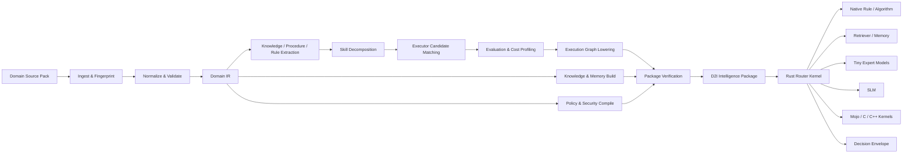
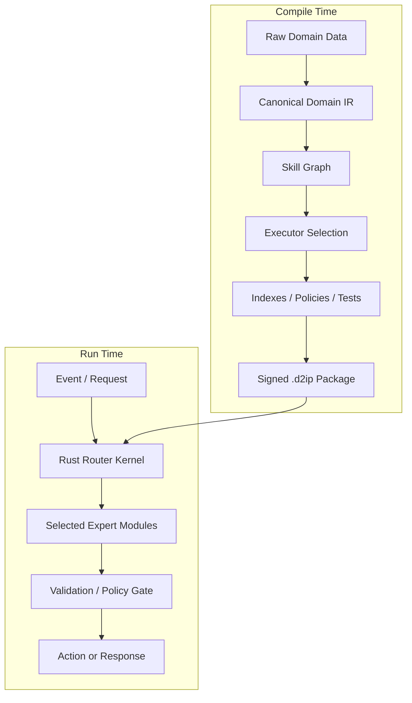
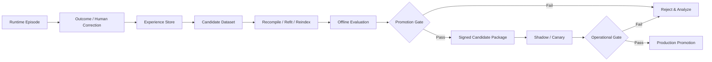

# D2I Open Autonomous Digital Workforce OS - Compiler Subsystem

D2I compiles an organization's Domain, Role, Authority, Application Semantics,
Organizational Memory, Work Sources, and execution means into bounded
autonomous digital employees capable of general office and computer work.
General Office Operations Employee is the canonical reference Role;
domain-specific vocabularies remain outside Core.

## Active Workforce Overlay

The compiler and package architecture remains unchanged by Workforce
governance. `D2I-WORK-100 - Role Contract v1`, `D2I-WORK-200 - Work Item /
Case Contract v1`, `D2I-WORK-300 - Work Radar and Work Intake`, and
`D2I-WORK-400 - Work Queue, Scheduler and Case Ownership`, and
`D2I-WORK-500 - Situation Model and Adaptive Planner`, `D2I-WORK-600 -
Episodic Memory and Case Learning Records`, and `D2I-WORK-700 - Role-level
Reporting, SLA and Escalation`, and `D2I-WORK-800 - Open Digital Employee
Shadow Mode` are complete
as additive platform-neutral contracts with Desktop-owned protected persistent
runtime boundaries. The active next task is `D2I-WORK-900 - Limited Autonomy
and Human-by-Exception Operation`.

WORK-700 is governed by ADR 0034 and
`docs/workforce/role-reporting-sla-escalation-v1.md`. It preserves immutable
Role and Case contracts, accepts trusted caller time, adds only pause-aware SLA
runtime projections, uses closed evidence-grounded KPI formulas, and limits
report publication and escalation to protected internal inboxes. It adds no
Compiler IR, package format, runtime ABI, model, external connector, or
background service. Its official All and Completion gates are complete.

## Product Context

D2I는 조직의 Domain, Role, Authority, Application Semantics,
Organizational Memory, Work Sources와 실행 수단을 일반 사무 및 컴퓨터
업무를 수행하는 bounded 자율 디지털 직원으로 컴파일하는 Open
Autonomous Digital Workforce OS다.

D2IC는 전체 제품이 아니라 compile-time subsystem이다. 기존 Domain
Source Pack과 Intelligence Package 계약을 보존하면서 다음 compile-time
자산으로 확장한다.

- Domain Pack
- Role Pack
- Application Pack
- Policy and Authority Pack
- Evaluation Pack
- Runtime/Capability binding
- Autonomous Workforce Package

Runtime은 패키지로부터 Role Instance를 만들고 Work Radar와 Case Queue를
통해 Case를 발견·소유한다. 완료는 생성된 보고서가 아니라 verified
outcome과 audit evidence로 판정한다. 사람은 Role, 권한, 금지사항, KPI,
위험 한도, 보고와 escalation을 설계하고 법적·비가역·고위험·불확실
예외에 개입한다. 목표는 Human-in-every-loop가 아니라
Human-by-exception이다.

장기 핵심 자산은 Domain과 Skill뿐 아니라 Role, Case, Episode다. D2I
Cognitive Control Plane은 Desktop/Enterprise Application,
API/ERP/MES/CMMS, Camera/Sensor/IoT, PLC/SCADA/OT,
Robot/AMR/Drone execution plane을 조율한다. PLC 안전제어, 모터제어,
긴급정지는 각 전용 안전 계층에 남는다.

이 제품 문맥은 아래 Compiler, runtime, package, ABI 불변조건을
약화하거나 대체하지 않는다. 제품 방향의 canonical source는
`docs/product/autonomous-workforce-os.md`다.

---

# Domain-to-Intelligence Compiler(D2IC)
## Codex 구현용 마스터 작업지시서

- 문서 버전: 0.1
- 상태: 구현 기준선(Baseline Specification)
- 대상: Codex를 이용해 저장소를 설계·구현하는 개발자 및 기술 책임자
- 기본 언어: Rust
- 선택적 고성능 백엔드: Mojo / C / C++ / MLIR 계열
- 기본 배포 형태: 오프라인·로컬·온프레미스
- 핵심 전제: 별도로 존재하는 독자 고효율 런타임 및 기능별 모델 아키텍처를 `RuntimeAdapter` 경계로 연결한다.

---

# 1. 프로젝트의 한 문장 정의

> **고객사의 업무 데이터·절차·판단 기준·노하우·사례를 입력받아, 독자 런타임에서 실행 가능한 초경량 업무특화 지능 패키지로 변환하는 컴파일러를 구축한다.**

이 프로젝트는 일반적인 챗봇 빌더, RAG 제작도구, LLM 프롬프트 생성기, 문서 검색기와 다르다.

컴파일러의 결과물은 단순한 색인이나 프롬프트가 아니라 다음을 하나로 결합한 **실행 가능한 Intelligence Package**다.

- 업무 지식
- 절차
- 판단 규칙
- 예외 규칙
- 기능별 모델 바인딩
- 라우팅 그래프
- 메모리·상태 정의
- 권한·보안 정책
- 신뢰도 임계값
- 평가셋
- 출처 및 빌드 이력
- 배포 대상 하드웨어 정보

---

# 2. 반드시 구분할 개념

## 2.1 컴파일러

`Domain Source Pack`을 읽고, 검증하고, 내부표현(IR)으로 변환하고, 실행기 후보를 선택하고, 최적화한 뒤 `D2I Intelligence Package`를 생성하는 빌드 시스템이다.

## 2.2 런타임

컴파일된 패키지를 로드해 요청·이벤트·센서 상태에 따라 필요한 기능 모델만 활성화하는 실행 시스템이다.

이 문서에서는 참조 런타임을 구현하지만, 실제 독자 고효율 런타임은 어댑터로 연결한다.

## 2.3 기능 모델(Expert Module)

하나의 좁은 기능을 수행하는 실행 단위다.

예:

- 의도 분류
- 필드 추출
- 용어 정규화
- 문서 검색
- 사례 검색
- 규칙 판단
- 이상 탐지
- 계획
- 점수 계산
- 자연어 설명
- 행동 명령 생성

기능 모델은 신경망일 수도 있고 아닐 수도 있다.

- 규칙 엔진
- 해시·조회 테이블
- 검색기
- 통계 모델
- 작은 신경망
- SLM
- 네이티브 함수
- Mojo/C/C++ 커널
- 외부 장치 드라이버

모두 동일한 `Executor` 계약 아래에서 실행 가능해야 한다.

## 2.4 업무 지능(Skill)

사용자 또는 시스템 관점에서 의미 있는 업무 능력이다.

예:

- “설비 증상을 받아 점검 순서를 결정한다.”
- “발주서에서 필드를 추출하고 처리 경로를 결정한다.”
- “견적요청을 분석해 유사 사례와 원가 계산 결과를 결합한다.”

하나의 Skill은 여러 기능 모델의 실행 그래프로 구성될 수 있다.

## 2.5 Intelligence Package

컴파일러의 최종 배포 산출물이다. 확장자는 임시로 `.d2ip`를 사용한다.

---

# 3. 프로젝트 목표와 비목표

## 3.1 1차 목표

1. 고객 업무 데이터를 표준화된 소스 팩으로 수용한다.
2. 업무 지식·절차·규칙·사례를 타입이 있는 IR로 변환한다.
3. 각 Skill을 기능 단위로 분해하고 실행 그래프로 구성한다.
4. 기능별 실행기 후보 중 목표 정확도·속도·메모리 조건을 만족하는 최소 비용 실행기를 선택한다.
5. 독자 런타임이 로드할 수 있는 패키지를 생성한다.
6. 같은 입력과 설정으로 동일한 산출물을 재현한다.
7. 모든 판단에 출처·모듈·버전·신뢰도·처리시간을 남긴다.
8. 네트워크 없이 빌드와 실행이 가능하도록 한다.
9. 향후 자가학습을 “후보 생성 → 평가 → 승인 → 승격” 파이프라인으로 확장할 수 있게 한다.

## 3.2 MVP 비목표

다음은 MVP에서 구현하지 않는다.

- 새로운 범용 언어모델을 처음부터 사전학습
- 고객사 전체 업무를 자동으로 이해하는 범용 에이전트
- 검증 없는 온라인 가중치 자기변경
- 휴머노이드 관절·모터의 실시간 안전제어
- PDF OCR·영상·음성 전체 파이프라인
- 분산학습 클러스터
- 클라우드 제어판
- 자체 벡터 데이터베이스의 완전한 구현
- 새로운 프로그래밍 언어를 처음부터 설계
- MLIR Dialect의 조기 구현
- Mojo를 필수 런타임 의존성으로 고정

MVP의 목적은 **컴파일 계약과 패키지 계약을 먼저 완성하는 것**이다.

---

# 4. 핵심 설계 원칙

## P1. Compile-time complexity, runtime simplicity

복잡한 분석·검증·그래프 생성·실행기 선택은 컴파일 시점에 수행한다.  
런타임은 가능한 한 미리 결정된 실행 그래프를 빠르게 실행한다.

## P2. Minimal intelligence activation

요청 하나를 처리하기 위해 전체 모델군을 실행하지 않는다. 필요한 기능 모델만 활성화한다.

## P3. Smallest adequate executor

각 기능에 대해 목표 품질을 충족하는 가장 작은 실행기를 선택한다.

선택 우선순위의 기본값:

1. 상수·캐시
2. 결정 규칙
3. 조회·검색
4. 수치 알고리즘
5. 전통적 분류·회귀
6. 초소형 신경망
7. 소형 언어모델
8. 더 큰 모델
9. 사람 검토

앞 단계가 평가 기준을 충족하면 뒤 단계를 선택하지 않는다.

## P4. Model-agnostic

컴파일러와 패키지 형식은 특정 모델, 특정 프레임워크, 특정 언어에 종속되지 않는다.

## P5. Offline-first and deny-by-default

기본 빌드와 런타임은 외부 네트워크를 사용하지 않는다. 네트워크 기능은 명시적 feature와 정책이 있을 때만 허용한다.

## P6. Data movement is a first-class cost

모델 연산뿐 아니라 다음을 모두 비용으로 계측한다.

- 메모리 복사 횟수
- 복사 바이트
- 직렬화·역직렬화
- 모듈 전환
- 콜드 로딩
- 캐시 미스
- 프로세스 간 이동
- 장치 간 이동

## P7. Deterministic by default

동일한 소스·설정·도구체인에서 동일한 패키지 해시를 생성한다. 비결정적 모델이 포함되면 그 사실과 seed·설정을 명시한다.

## P8. Evaluation-gated intelligence

정확도·업무 성공률·치명 오류 기준을 통과하지 못한 모듈이나 패키지는 배포 산출물로 승격하지 않는다.

## P9. Explicit provenance

모든 지식과 결과는 가능한 범위에서 원본 데이터, 규칙, 모델 버전, 컴파일 패스와 연결한다.

## P10. Self-learning is controlled promotion

운영 중 경험은 즉시 핵심 지능을 변형하지 않는다. 경험을 후보 데이터로 수집하고, 오프라인 평가를 거친 서명된 새 패키지만 운영 버전으로 승격한다.

---

# 5. 전체 개념 구조



## 5.1 컴파일 시간과 실행 시간의 분리



## 5.2 향후 학습 루프



---

# 6. 시스템 경계

## 6.1 D2I Compiler가 책임지는 것

- 소스 팩 읽기
- 파일 해시 및 출처 추적
- 스키마 검증
- 텍스트·표·규칙·사례 정규화
- 타입이 있는 Domain IR 생성
- Skill 정의 및 실행 그래프 생성
- 모델·실행기 레지스트리와 매칭
- 평가 데이터 실행
- 비용·성능 프로파일 적용
- 라우팅 그래프 최적화
- 검색 색인·규칙 테이블 생성
- 정책 컴파일
- 패키징·서명·검증
- 패키지 diff 및 호환성 검사

## 6.2 D2I Runtime이 책임지는 것

- 패키지 로딩
- ABI 및 해시 검증
- 이벤트 수신
- 모델 활성화·비활성화
- 실행 그래프 스케줄링
- 병렬 실행
- 메모리 아레나 관리
- timeout·watchdog
- 결과 통합
- 정책 게이트
- 감사 로그
- 경험 이벤트 기록

## 6.3 기존 독자 아키텍처가 책임지는 것

기존 구현에 따라 달라지므로 컴파일러에서 추측하지 않는다. 다음 계약만 정의한다.

- 기능 모델 등록
- 모델 capability 조회
- 입력·출력 스키마
- 모델 로딩 및 언로딩
- 실행
- 상태 reset
- 성능 메트릭
- 오류 코드
- 런타임 버전
- 패키지 호환성

Codex는 기존 구현을 재작성하지 말고 `RuntimeAdapter` trait와 mock/reference adapter를 만든다.

---

# 7. Domain Source Pack

## 7.1 권장 디렉터리 구조

```text
example-domain/
├─ domain.yaml
├─ schemas/
│  ├─ request.schema.json
│  ├─ result.schema.json
│  └─ entities.schema.json
├─ data/
│  ├─ documents/
│  │  ├─ manual-001.md
│  │  └─ faq-001.txt
│  ├─ tables/
│  │  ├─ products.csv
│  │  └─ cases.csv
│  └─ records/
│     └─ historical-events.jsonl
├─ procedures/
│  ├─ diagnose-fault.yaml
│  └─ escalate-case.yaml
├─ rules/
│  ├─ routing.yaml
│  └─ constraints.yaml
├─ examples/
│  ├─ positive.jsonl
│  ├─ negative.jsonl
│  └─ edge-cases.jsonl
├─ eval/
│  ├─ gold.jsonl
│  └─ thresholds.yaml
├─ models/
│  └─ bindings.yaml
├─ security/
│  └─ policy.yaml
└─ README.md
```

## 7.2 `domain.yaml` 예시

아래 수치는 예시일 뿐 제품 기본값이 아니다.

```yaml
d2i_version: "0.1"

domain:
  id: "equipment-maintenance-demo"
  version: "0.1.0"
  name: "설비 유지보수 데모"
  languages: ["ko", "en"]

target:
  os: "linux"
  arch: "x86_64"
  network_policy: "deny"
  max_memory_mb: 2048
  preferred_device: "cpu"

objectives:
  min_task_success_rate: 0.95
  max_critical_error_rate: 0.001
  target_p95_latency_ms: 20
  deterministic: true

sources:
  - path: "data/documents"
    kind: "knowledge"
    trust: "approved"
  - path: "data/tables/cases.csv"
    kind: "historical_cases"
    trust: "verified"
  - path: "procedures"
    kind: "procedure"
    trust: "approved"
  - path: "rules"
    kind: "rule"
    trust: "approved"

skills:
  - id: "diagnose_fault"
    version: "1"
    input_schema: "schemas/request.schema.json"
    output_schema: "schemas/result.schema.json"
    criticality: "high"
    fallback: "human_review"
    evidence_required: true

evaluation:
  dataset: "eval/gold.jsonl"
  thresholds: "eval/thresholds.yaml"

package:
  signing: "required"
  include_source_data: false
  include_eval_data: true
```

## 7.3 MVP에서 지원할 입력 형식

필수:

- UTF-8 Markdown
- UTF-8 plain text
- CSV
- JSON
- JSONL
- YAML
- JSON Schema

후속:

- DOCX
- PDF 텍스트
- PDF 표·이미지
- XLSX
- 데이터베이스 커넥터
- 음성
- 영상
- 센서 스트림

MVP에서는 문서 파싱의 범위를 넓히지 말고 컴파일 계약을 우선한다.

---

# 8. D2I 내부표현(IR)

MVP에서는 별도의 새 언어 파서를 만들지 않는다.

- 사람이 편집하는 소스: YAML / JSON / JSONL
- 컴파일러 내부: 타입이 있는 Rust 구조체
- 패키지 메타데이터: 버전이 있는 FlatBuffers 스키마
- 대용량 표·텐서: 별도 바이너리 블롭과 메타데이터
- 향후 하드웨어별 lowering이 필요해질 때 MLIR Dialect를 검토

## 8.1 Domain IR

업무 세계의 의미를 표현한다.

```text
DomainIR
├─ Entities
├─ Attributes
├─ Relations
├─ Terminology
├─ Documents
├─ Facts
├─ Procedures
├─ Rules
├─ Examples
├─ Outcomes
└─ Provenance
```

핵심 타입:

- `EntityType`
- `EntityInstance`
- `RelationType`
- `Fact`
- `Term`
- `Procedure`
- `ProcedureStep`
- `Rule`
- `ExceptionRule`
- `Example`
- `Outcome`
- `EvidenceRef`
- `Provenance`

## 8.2 Skill IR

업무 능력의 계약을 표현한다.

```text
SkillIR
├─ SkillId / Version
├─ Input Schema
├─ Output Schema
├─ Preconditions
├─ Postconditions
├─ Required Evidence
├─ Criticality
├─ Confidence Policy
├─ Fallback
├─ Evaluation Spec
└─ Candidate Executors
```

## 8.3 Execution IR

기능 모델의 실행 그래프를 표현한다.

노드 유형:

- `ReadInput`
- `Normalize`
- `Lookup`
- `Retrieve`
- `RuleEval`
- `NativeCall`
- `ModelCall`
- `Parallel`
- `Join`
- `Branch`
- `LoopBounded`
- `Validate`
- `PolicyGate`
- `HumanReview`
- `Return`

각 노드는 다음을 가져야 한다.

- 입력·출력 타입
- timeout
- 예상 메모리
- 실행기 ID
- 신뢰도
- 실패 경로
- 재시도 정책
- 캐시 정책
- side effect 여부
- 병렬 가능 여부
- 출처 요구 여부

## 8.4 Knowledge IR

- chunk
- term index
- entity index
- relation index
- sparse retrieval index
- optional vector index
- case index
- source trust
- effective date
- access labels

RAG는 Knowledge IR을 사용하는 여러 실행기 중 하나일 뿐이다.

## 8.5 Policy IR

- 사용자·역할 권한
- 데이터 등급
- 허용 실행기
- 외부 통신 여부
- 자동 실행 가능 범위
- 사람 승인 조건
- confidence threshold
- 금지 동작
- 로그·보존 정책

## 8.6 Evaluation IR

- 테스트 입력
- 예상 출력
- 허용 오차
- 치명 오류 조건
- 평가기
- 데이터 분할
- 난이도
- 출처
- 회귀 테스트 ID

---

# 9. 컴파일 파이프라인

CLI의 `compile`은 아래 패스를 순서대로 실행한다.

## Pass 0. Discover

목적:

- 소스 팩 루트 확인
- manifest 로드
- 지원 버전 확인
- 파일 목록 생성
- 경로 이탈·심볼릭 링크 정책 검증

산출물:

- `SourceInventory`
- 초기 진단 목록

## Pass 1. Fingerprint

목적:

- 모든 입력 파일의 콘텐츠 해시
- 크기·MIME·인코딩·수정시간 기록
- 빌드 입력 세트 고정

산출물:

- `source.lock`
- provenance graph 시작점

## Pass 2. Parse

목적:

- 형식별 파서 실행
- 위치 정보가 있는 AST 또는 record 생성
- 오류를 파일·라인·필드 단위로 보고

원칙:

- 오류 하나로 즉시 중단하지 말고 가능한 범위에서 진단을 누적
- strict 모드에서는 warning도 실패 가능
- 파서에서 의미 해석을 과도하게 수행하지 않음

## Pass 3. Normalize

목적:

- 유니코드 정규화
- 공백·개행 정규화
- 날짜·단위·숫자 표준화
- 용어 alias 처리
- ID 생성
- 중복 레코드 후보 탐지

산출물:

- `CanonicalSource`

## Pass 4. Validate Domain

목적:

- 스키마 일치
- 참조 무결성
- procedure step 연결
- rule target 유효성
- 누락된 출력·fallback
- 순환 의존성
- 비결정적·위험한 설정 탐지

## Pass 5. Build Domain IR

목적:

- 원시 데이터를 타입이 있는 Domain IR로 변환
- 모든 요소에 provenance 연결
- 승인·신뢰·유효기간 메타데이터 반영

## Pass 6. Decompose Skills

초기에는 사람이 작성한 Skill 정의를 기준으로 한다.

후속 단계에서 반자동 기능:

- 사례에서 공통 task 후보 발견
- 절차에서 단계 추출
- 입력·출력 후보 제안
- 전문가 검토용 diff 생성

Codex는 MVP에서 자동 업무발견을 구현하지 않는다.

## Pass 7. Match Executors

`ModelRegistry`와 `ExecutorRegistry`에서 후보를 찾는다.

후보는 다음 hard constraint를 먼저 통과해야 한다.

- OS·architecture 호환
- 메모리 제한
- 네트워크 정책
- 입력·출력 스키마 호환
- 라이선스 정책
- criticality 허용
- 결정성 요구
- 런타임 ABI
- 패키지 버전

## Pass 8. Evaluate Candidates

후보마다 gold set을 실행한다.

필수 지표:

- task success rate
- field accuracy
- precision / recall / F1
- numeric error
- critical error rate
- p50 / p95 / p99 latency
- cold start
- peak RSS
- allocated bytes
- copy count / copy bytes
- activated modules
- timeout rate
- deterministic repeatability

## Pass 9. Select and Lower

hard constraint를 만족한 후보 중 최소 비용 실행기를 선택한다.

개념적 비용함수:

```text
cost =
    latency_weight * normalized_latency
  + memory_weight  * normalized_memory
  + energy_weight  * normalized_energy
  + risk_weight    * normalized_risk
  + size_weight    * normalized_package_size
  + switch_weight  * normalized_transition_cost
```

품질은 hard constraint로 먼저 처리한다.

```text
quality >= required_quality
critical_error <= max_critical_error
```

그 후 비용 최소화를 수행한다.

중요:

- 단순 가중합만 구현하지 말고 Pareto 후보를 보존
- 선택 이유를 build report에 남김
- 사용자가 명시적으로 executor를 고정할 수 있음

## Pass 10. Optimize Execution Graph

최적화 예:

- 상수 접기
- 중복 조회 제거
- 공통 전처리 합치기
- 독립 노드 병렬화
- 불필요한 자연어 생성 제거
- 캐시 가능한 노드 표시
- hot module 예측
- 같은 데이터 표현을 사용하는 노드 병합
- copy 최소화
- 실패 경로 단축
- confidence가 충분하면 뒤 단계 생략
- small-first cascade 생성

## Pass 11. Build Knowledge & Memory

MVP:

- exact lookup
- term dictionary
- sparse lexical retrieval
- procedure index
- case index

후속:

- local embedding
- vector index
- reranker
- entity graph
- temporal knowledge
- episodic memory

## Pass 12. Compile Policies

정책을 런타임에서 빠르게 판정 가능한 테이블·비트셋·결정트리로 낮춘다.

## Pass 13. Generate Evaluation Bundle

패키지와 함께 다음을 생성한다.

- 전체 평가 요약
- 실패 사례
- 회귀 테스트
- executor별 성능
- 선택 근거
- 치명 오류 목록
- 데이터 커버리지
- 빌드 환경

## Pass 14. Package

- manifest
- IR
- indexes
- executor bindings
- model artifacts
- policies
- evaluation bundle
- provenance
- SBOM
- license report
- hashes
- signature

## Pass 15. Verify

생성 직후 패키지를 다시 열어 다음을 검사한다.

- 모든 파일 해시
- 스키마 버전
- ABI
- 필수 파일
- 서명
- 실행기 존재
- 평가 결과
- target 호환성

---

# 10. 실행기 레지스트리와 기능별 모델 선택

## 10.1 `ExecutorDescriptor`

각 실행기는 최소한 다음 메타데이터를 제공한다.

```yaml
id: "native.regex-router"
version: "1.0.0"
kind: "native"
abi: "d2i-executor-v1"
capabilities:
  - "intent_classification"
input_schemas:
  - "d2i://schemas/text-request/v1"
output_schemas:
  - "d2i://schemas/intent-result/v1"
targets:
  - os: "linux"
    arch: "x86_64"
resource_profile:
  resident_memory_bytes: 1048576
  cold_start_us: 50
  deterministic: true
security:
  network: false
  side_effects: false
license:
  id: "Proprietary"
artifact:
  path: "executors/libregex_router.so"
  sha256: "..."
```

## 10.2 실행기 종류

```text
ExecutorKind
├─ Constant
├─ Cache
├─ Rule
├─ Lookup
├─ Search
├─ NativeFunction
├─ ClassicalModel
├─ NeuralExpert
├─ LanguageExpert
├─ Planner
├─ DeviceAdapter
└─ HumanReview
```

## 10.3 실행기 선택 알고리즘의 1차 구현

```text
for skill in skills:
    candidates = registry.match(skill.capability, skill.io_schema, target)

    feasible = []
    for candidate in candidates:
        if not satisfies_hard_constraints(candidate, skill, target):
            continue

        report = evaluate(candidate, skill.eval_set)
        if report.quality_passed and report.safety_passed:
            feasible.append((candidate, report))

    if feasible is empty:
        bind(skill, fallback_or_fail)
    else:
        pareto = pareto_front(feasible)
        selected = choose_min_cost(pareto, target.weights)
        bind(skill, selected)
        record_selection_reason(skill, selected, pareto)
```

## 10.4 기능 모델이 여러 개인 경우

하나의 Skill에 대해 여러 실행기를 조합할 수 있다.

예:

```text
입력 정규화
  ↓
의도 분류
  ↓
┌───────────────────┬───────────────────┐
│ 정확한 코드 조회  │ 사례 검색          │
└───────────────────┴───────────────────┘
  ↓
규칙 판단
  ↓
confidence < threshold ?
  ├─ No  → 결과
  └─ Yes → 더 강한 모델 또는 사람
```

---

# 11. Runtime 및 ABI 방향

## 11.1 핵심 원칙

- Rust 라우터 커널이 전체 수명과 메모리를 소유한다.
- 모델 간 통신은 Rust 객체나 Mojo 객체에 종속시키지 않는다.
- 안정된 C ABI 또는 자체 버전 ABI를 사용한다.
- 모델은 메모리를 직접 해제하지 않는다.
- panic 또는 예외가 FFI 경계를 넘지 않는다.
- 입력과 출력은 명시적 view로 전달한다.
- hot path에서 JSON을 사용하지 않는다.
- control metadata와 대용량 payload를 분리한다.

## 11.2 참조 ABI 개념

정확한 헤더는 Phase 2에서 확정한다.

```c
typedef enum {
    D2I_OK = 0,
    D2I_INVALID_ARGUMENT = 1,
    D2I_TIMEOUT = 2,
    D2I_INTERNAL = 3,
    D2I_UNSUPPORTED = 4
} D2iStatus;

typedef struct {
    const uint8_t* ptr;
    size_t len;
    size_t alignment;
    uint32_t memory_kind;
    uint32_t flags;
} D2iBufferView;

typedef struct {
    uint32_t abi_version;
    const char* module_id;
    const char* module_version;

    D2iStatus (*init)(
        const D2iBufferView* config,
        void** out_handle
    );

    D2iStatus (*run)(
        void* handle,
        const D2iBufferView* input,
        D2iBufferView* output
    );

    D2iStatus (*reset)(void* handle);
    void (*destroy)(void* handle);
} D2iModuleV1;
```

FFI 구현 규칙:

- `#[repr(C)]`
- 고정 폭 정수
- 명시적 endian
- 버전 필드
- opaque handle
- 소유권 문서화
- 문자열은 UTF-8 byte slice 또는 수명이 명시된 C string
- callback의 thread-safety 표기
- host allocator 사용
- ABI compatibility test
- FFI fuzz test
- `catch_unwind` 또는 동등한 경계 처리
- 동적 라이브러리 심볼 검증

## 11.3 대용량 데이터 교환

권장 계층:

- Control/metadata: FlatBuffers
- Tabular/record batch: Arrow C Data Interface adapter
- Dense tensor: DLPack adapter
- 간단한 byte payload: `D2iBufferView`
- 프로세스 간: 별도 shared-memory transport
- 네트워크: MVP 범위 밖

MVP는 `D2iBufferView`와 타입이 있는 Rust 구조로 시작하고, Arrow/DLPack은 어댑터로 추가한다.

## 11.4 Mojo의 위치

Mojo는 다음과 같은 **교체 가능한 연산 백엔드**로 둔다.

- SIMD 전처리
- 검색 점수 계산
- 텐서 연산
- 커널 융합
- CPU/GPU/NPU별 최적화
- 데이터 변환
- 특정 expert inference

금지:

- 패키지 포맷을 Mojo 전용으로 설계
- Rust 커널이 Mojo 런타임 내부 객체를 직접 소유
- Mojo가 없으면 컴파일러가 빌드되지 않는 구조
- C ABI 없이 비공개 언어 ABI에 의존
- Mojo 문법·버전에 전체 저장소를 고정

구조:

```text
Rust Compiler / Router
        │
        ├─ Stable D2I ABI
        │
        ├─ Rust native executor
        ├─ C/C++ executor
        ├─ Mojo executor
        └─ Existing proprietary runtime adapter
```

## 11.5 MLIR의 위치

MVP에서는 구현하지 않는다.

다음 조건이 확인될 때 별도 RFC 후 검토한다.

- 여러 하드웨어 target에 동일 그래프를 lowering해야 함
- 연산 융합이 실제 병목
- 자체 DSL/IR 변환 규칙이 충분히 안정됨
- 독자 실행 그래프에서 하드웨어 코드 생성 이득이 확인됨

---

# 12. 공유 상태와 메모리 모델

## 12.1 `TaskContext`

```text
TaskContext
├─ RequestId
├─ BuildId
├─ SkillId
├─ Actor / Role
├─ Deadline
├─ Current State
├─ Input Views
├─ Evidence Set
├─ Intermediate Results
├─ Confidence
├─ Policy Decisions
├─ Module Timings
├─ Error Stack
└─ Output
```

## 12.2 Memory Arena 원칙

- request-scoped arena
- optional session-scoped cache
- immutable view 기본
- 사전 할당 가능
- alignment 보장
- 메모리 상한
- timeout 시 회수
- 모듈별 할당량 계측
- hot path allocation 계측
- 대용량 객체 복사 금지
- data owner 명시

## 12.3 상태 유형

- `StaticDomainMemory`: 패키지에 포함된 지식
- `WorkingMemory`: 한 요청의 중간 상태
- `SessionMemory`: 제한된 대화·업무 세션 상태
- `EpisodicMemory`: 운영 경험
- `OperationalState`: 외부 시스템의 최신 상태
- `ModelState`: 기능 모델의 내부 상태

각 상태의 보존 기간·권한·업데이트 방법을 별도로 둔다.

---

# 13. 결과 계약: Decision Envelope

모든 Skill 실행 결과는 통일된 envelope로 반환한다.

```json
{
  "request_id": "req-001",
  "build_id": "sha256:...",
  "skill_id": "diagnose_fault",
  "status": "success",
  "output": {
    "fault_code": "BRG-02",
    "next_step": "베어링 진동 측정"
  },
  "confidence": 0.97,
  "evidence": [
    {
      "source_id": "manual-001",
      "span": "L120-L138",
      "trust": "approved"
    }
  ],
  "modules_used": [
    "term-normalizer@1",
    "case-search@2",
    "rule-diagnosis@4"
  ],
  "policy": {
    "automatic_action_allowed": false,
    "human_review_required": true
  },
  "timing_us": {
    "total": 1800,
    "routing": 40,
    "search": 600,
    "decision": 500
  },
  "warnings": []
}
```

필수:

- 결과
- 신뢰도
- 출처
- 사용 모듈
- 빌드 ID
- 정책 판정
- 처리시간
- 경고·오류

---

# 14. 패키지 형식

## 14.1 논리 구조

```text
equipment-maintenance.d2ip/
├─ manifest.fb
├─ ir/
│  ├─ domain.fb
│  ├─ skills.fb
│  ├─ execution.fb
│  ├─ policies.fb
│  └─ evaluation.fb
├─ knowledge/
│  ├─ terms.bin
│  ├─ documents.bin
│  ├─ sparse-index.bin
│  └─ cases.bin
├─ executors/
│  ├─ bindings.fb
│  ├─ native/
│  ├─ models/
│  └─ adapters/
├─ schemas/
├─ eval/
│  ├─ report.json
│  ├─ failures.jsonl
│  └─ regression.jsonl
├─ provenance/
│  ├─ sources.lock
│  ├─ build.json
│  ├─ licenses.json
│  └─ sbom.json
├─ hashes.sha256
└─ signature.ed25519
```

## 14.2 패키지 원칙

- hot-path 파일은 memory-map 가능
- runtime에서 전체 JSON 파싱 금지
- 패키지 내부 절대 경로 금지
- 콘텐츠 주소 지정
- 버전 호환성 표
- 압축 파일을 런타임 hot path에서 직접 읽지 않음
- package archive는 배포 편의를 위한 외피일 뿐, 배포 시 검증 후 추출 가능
- source data 포함 여부 명시
- 민감 데이터 암호화 옵션
- 서명 필수 모드 제공

## 14.3 버전

세 가지 버전을 분리한다.

- `compiler_version`
- `package_format_version`
- `runtime_abi_version`

패키지 자체의 domain version과도 분리한다.

---

# 15. CLI 명세

실행 파일 이름: `d2ic`

```text
d2ic init <dir>
d2ic inspect <source-or-package>
d2ic validate <source-dir>
d2ic compile <source-dir> --out <package-dir>
d2ic eval <source-or-package>
d2ic benchmark <package> --runtime reference
d2ic verify <package>
d2ic diff <old-package> <new-package>
d2ic explain <package> --skill <id>
d2ic clean <build-dir>
```

## 15.1 공통 옵션

```text
--config <path>
--target <triple>
--profile <dev|release|edge>
--offline
--strict
--json
--log-level <level>
--cache-dir <path>
--no-cache
```

## 15.2 CLI 요구사항

- 사람이 읽는 출력과 machine-readable JSON 출력 제공
- 오류 코드 문서화
- 모든 오류에 파일·라인·필드 위치 포함
- 성공 시 build ID 출력
- `--offline`이 기본 동작
- diagnostic에는 remediation hint 포함
- secrets를 로그에 출력하지 않음

---

# 16. 권장 저장소 구조

초기에는 지나친 crate 분할을 피한다.

```text
d2i-compiler/
├─ AGENTS.md
├─ README.md
├─ Cargo.toml
├─ Cargo.lock
├─ rust-toolchain.toml
├─ deny.toml
├─ LICENSES/
├─ docs/
│  ├─ architecture.md
│  ├─ package-format.md
│  ├─ runtime-abi.md
│  ├─ threat-model.md
│  ├─ benchmark-methodology.md
│  └─ adr/
├─ schemas/
│  ├─ flatbuffers/
│  └─ json-schema/
├─ crates/
│  ├─ d2i-core/
│  ├─ d2i-compiler/
│  ├─ d2i-cli/
│  ├─ d2i-runtime-api/
│  ├─ d2i-runtime-ref/
│  ├─ d2i-eval/
│  └─ d2i-ffi/
├─ backends/
│  ├─ native-rust/
│  ├─ mojo/
│  └─ existing-runtime-adapter/
├─ examples/
│  └─ equipment-maintenance/
├─ tests/
│  ├─ fixtures/
│  ├─ golden/
│  ├─ abi/
│  └─ reproducibility/
├─ benches/
├─ scripts/
└─ xtask/
```

## 16.1 crate 역할

### `d2i-core`

- 공통 ID
- diagnostic
- hash
- provenance
- version
- source location
- domain types

### `d2i-compiler`

- source load
- parse
- normalize
- IR
- passes
- lowering
- package build

### `d2i-cli`

- CLI만 담당
- 핵심 로직을 포함하지 않음

### `d2i-runtime-api`

- runtime trait
- executor trait
- task context
- decision envelope
- registry
- package loader contract

### `d2i-runtime-ref`

- 정확성 검증용 참조 런타임
- 최고 성능을 목표로 하지 않음
- 기존 독자 런타임과 결과 비교에 사용

### `d2i-eval`

- 평가 데이터
- metric
- golden test
- regression
- benchmark metadata

### `d2i-ffi`

- C ABI
- unsafe 코드
- 동적 라이브러리 로딩
- ABI test

---

# 17. Rust 구현 규칙

## 17.1 필수

- stable Rust 사용
- `rust-toolchain.toml`로 검증된 버전 고정
- workspace dependency 중앙 관리
- `cargo fmt`
- `cargo clippy --workspace --all-targets --all-features -- -D warnings`
- `cargo test --workspace --all-features`
- release build
- 공개 API 문서화
- 라이브러리 내부에서 구조화된 오류 사용
- CLI에서만 사용자 메시지 렌더링

## 17.2 `unsafe`

`unsafe`는 다음 모듈에 한정한다.

- FFI
- memory map
- arena low-level
- SIMD intrinsic wrapper
- dynamic library loading

각 `unsafe` 블록에는 `// SAFETY:` 주석으로 불변조건을 기록한다.

다른 crate에서 `unsafe`가 필요하면 ADR을 먼저 작성한다.

## 17.3 금지

- 라이브러리 코드의 무분별한 `unwrap`, `expect`
- hot path JSON
- 프로덕션 런타임의 Python 의존
- 전역 mutable state
- 숨은 네트워크 호출
- 임의의 shell command 실행
- 임시 파일에 민감 데이터 평문 저장
- FFI 경계를 넘는 Rust panic
- 검사되지 않은 path traversal
- 모델 결과를 사실로 간주
- benchmark 없는 성능 주장

---

# 18. MVP 참조 도메인

MVP 도메인은 `equipment-maintenance`로 한다. 실제 고객 데이터가 없어도 synthetic fixture로 파이프라인을 증명할 수 있기 때문이다.

## 18.1 Skill

`diagnose_fault`

입력:

- equipment_id
- symptom text
- error_code optional
- sensor snapshot optional
- recent maintenance optional

출력:

- normalized symptoms
- candidate fault codes
- recommended check sequence
- evidence
- confidence
- human review flag

## 18.2 기능 모듈

MVP에는 최소 세 모듈을 둔다.

1. `term-normalizer`
   - alias와 표준 용어를 매칭
   - 규칙·lookup 기반

2. `case-retriever`
   - 과거 사례 sparse retrieval
   - 로컬 실행
   - 네트워크 없음

3. `procedure-decider`
   - 절차와 규칙을 결합해 다음 점검 단계 선택
   - 결정적 구현

선택적 네 번째:

4. `explanation-renderer`
   - 템플릿 기반 설명
   - 생성형 모델 없이 구현

MVP의 목적은 범용 언어능력 시연이 아니라 다음을 검증하는 것이다.

- 데이터가 다른 domain pack으로 컴파일되는가
- 실행 그래프가 생성되는가
- 필요한 모듈만 호출되는가
- 결과 출처가 추적되는가
- 패키지가 재현 가능한가
- 참조 런타임과 기존 런타임이 동일 계약을 구현할 수 있는가

---

# 19. 개발 단계와 종료조건

단계를 건너뛰지 않는다.

## Phase 0. Repository and Contract Freeze

산출물:

- Cargo workspace
- root `AGENTS.md`
- architecture docs
- ADR template
- diagnostic model
- ID/version/hash types
- CI skeleton
- example source pack skeleton

종료조건:

- workspace build
- tests pass
- docs에서 compiler/runtime boundary가 명확
- 기존 런타임 코드를 수정하지 않음

## Phase 1. Source Pack Loader and Validator

산출물:

- `domain.yaml` loader
- file inventory
- path security
- hash
- JSON Schema validation
- diagnostic aggregation
- `d2ic validate`
- `d2ic inspect`

종료조건:

- 정상 fixture 통과
- 잘못된 경로·스키마·중복 ID·깨진 참조 오류 검출
- 동일 소스 inventory hash 재현
- 네트워크 호출 0

## Phase 2. Typed IR and Deterministic Package

산출물:

- Domain IR
- Skill IR
- Execution IR
- Policy IR
- FlatBuffers schema
- package writer/reader
- `d2ic compile`
- `d2ic verify`
- reproducibility test

종료조건:

- 동일 입력에서 package hash 동일
- reader/writer round-trip
- corrupted package 검출
- format version mismatch 진단

## Phase 3. Reference Runtime

산출물:

- package loader
- executor registry
- scheduler
- task context
- decision envelope
- three MVP modules
- `d2i-runtime-ref`

종료조건:

- 50개 이상의 gold cases
- 모든 결과에 evidence·module list·timing 존재
- 필요한 모듈만 실행됨
- timeout/fallback 테스트
- deterministic replay

## Phase 4. Evaluation and Executor Lowering

산출물:

- executor descriptors
- candidate matching
- benchmark profile import
- quality gate
- Pareto selection
- selection report
- `d2ic eval`
- `d2ic explain`

종료조건:

- 서로 다른 2개 executor 후보 중 설정에 따라 선택 변화
- quality 미달 후보 자동 제외
- 선택 근거가 build report에 남음
- regression failure가 build 실패로 연결

## Phase 5. Existing Runtime Adapter

산출물:

- `RuntimeAdapter` trait
- mock adapter
- ABI mapping
- package compatibility checker
- 독자 런타임 연결용 문서

종료조건:

- 참조 런타임과 기존 런타임이 동일 test vector 처리
- output schema 동일
- error mapping 동일
- 성능 비교 자동 리포트

주의:

- 기존 런타임의 실제 API가 제공되기 전에는 가짜 API를 발명하지 않는다.
- adapter placeholder와 명확한 TODO를 남긴다.

## Phase 6. Native ABI and Zero-copy Adapters

산출물:

- C ABI v1
- dynamic module loading
- buffer view
- optional Arrow adapter
- optional DLPack adapter
- ABI compatibility test
- fuzz test

종료조건:

- Rust native module과 C-compatible module 교차 실행
- 메모리 소유권 테스트
- double free/use-after-free 방지
- copy metrics 기록

## Phase 7. Mojo Backend Experiment

산출물:

- Mojo backend feature
- C ABI 경계
- 하나의 계산 커널
- Rust 기준 구현과 비교
- 빌드·버전 문서

종료조건:

- Mojo 미설치 시 전체 core 빌드 가능
- 결과 일치
- 실제 병목 구간에서만 사용
- 성능 향상이 없으면 backend를 제거 가능

## Phase 8. Experience and Learning Compiler

산출물:

- episode schema
- outcome/correction
- experience store
- candidate dataset builder
- candidate package
- offline evaluation
- promotion policy

종료조건:

- 운영 패키지를 직접 변경하지 않음
- candidate와 production 분리
- 회귀·치명 오류 gate
- 서명된 승격 이력

## Phase 9. Embodied / Robot Integration

MVP 이후 별도 프로젝트로 분리한다.

- ROS 2 adapter
- sensor event schema
- action contract
- deadline class
- safety controller boundary
- simulation replay
- robot-specific experience

D2I는 인지·계획·기억 계층을 담당하고, 안전 제어와 모터 제어를 분리한다.

---

# 20. 평가 전략

## 20.1 업무 성능

- task success rate
- fully automated completion rate
- human correction rate
- evidence accuracy
- wrong-route rate
- critical error rate
- unsupported-case detection
- fallback precision
- deterministic replay rate

## 20.2 시스템 성능

- end-to-end p50 / p95 / p99
- router overhead
- module execution time
- cold start
- warm start
- throughput
- peak RSS
- persistent memory
- bytes allocated
- memory copy count
- memory copy bytes
- module load/unload count
- cache hit
- context-switch count
- package load time
- power/energy when measurable

## 20.3 비교 원칙

“API LLM보다 1,000~2,000배 빠르다”와 같은 주장은 다음 조건이 같을 때만 공식 결과로 기록한다.

- 동일 업무 정의
- 동일 입력
- 동등한 정답 기준
- 동등한 성공률 또는 품질 구간
- 동일 출력 범위
- hardware와 network 조건 공개
- cold/warm 여부 공개
- 표본 수 공개
- p50뿐 아니라 p95/p99 공개
- 오류와 timeout 포함

API 왕복 지연과 로컬 규칙 판정을 단순 비교한 수치는 별도 지표로 표시하고, 업무 동등성 벤치마크와 혼합하지 않는다.

## 20.4 Benchmark Artifact

각 벤치마크는 다음을 저장한다.

```yaml
benchmark_id: "..."
build_id: "..."
date_utc: "..."
hardware:
  cpu: "..."
  cores: 0
  ram_bytes: 0
  gpu: null
software:
  os: "..."
  rustc: "..."
  compiler: "..."
dataset:
  id: "..."
  hash: "..."
  cases: 0
method:
  warmup: 0
  iterations: 0
metrics:
  task_success_rate: 0.0
  latency_p50_us: 0
  latency_p95_us: 0
  latency_p99_us: 0
  peak_rss_bytes: 0
  copy_bytes: 0
```

---

# 21. 테스트 전략

## 21.1 Unit tests

- 파서
- ID
- schema
- rules
- graph
- cost function
- package manifest
- policy

## 21.2 Golden tests

입력 source pack과 예상 IR/package report를 고정한다.

## 21.3 Integration tests

```text
source pack
→ compile
→ verify
→ load
→ execute
→ compare decision envelope
```

## 21.4 Reproducibility tests

- 서로 다른 build directory
- 파일 순서 변화
- 수정시간 변화
- 동일 콘텐츠

에서 동일 package content hash를 확인한다.

## 21.5 Property tests

- DAG에 잘못된 cycle이 남지 않음
- source reference가 사라지지 않음
- 패키지 path가 root를 탈출하지 않음
- policy deny가 allow로 바뀌지 않음

## 21.6 Fuzz tests

- manifest parser
- package reader
- FFI buffer metadata
- corrupted index
- FlatBuffers verification

## 21.7 ABI tests

- size
- alignment
- symbol name
- ABI version
- old module/new runtime
- new module/old runtime의 거부 동작

## 21.8 Security tests

- path traversal
- symlink escape
- decompression bomb
- oversized record
- malicious rule recursion
- untrusted plugin
- poisoned package
- signature mismatch
- secret in log
- policy bypass

---

# 22. 보안 및 위협모델

## 22.1 공격 표면

- 악성 고객 데이터
- 문서 안의 지시문
- 잘못된 규칙
- poisoned examples
- malicious plugin
- tampered model
- package replacement
- unauthorized source access
- runtime privilege escalation
- learning feedback poisoning
- log leakage
- path traversal
- resource exhaustion

## 22.2 기본 통제

- 입력은 데이터로 취급하고 명령으로 실행하지 않음
- source trust level
- 승인된 규칙과 제안 규칙 분리
- signed package
- content hash
- strict package verifier
- deny-by-default network
- role/label access
- sandbox 가능한 executor
- timeout
- memory limit
- bounded loop only
- side-effect node 명시
- human approval gate
- immutable production package
- learning candidate quarantine
- secret redaction
- local audit log

## 22.3 데이터와 지능의 분리

- 고객 원문
- 정규화 데이터
- 컴파일된 IR
- 모델 artifact
- 경험 로그

를 별도 암호화·보존 정책으로 관리한다.

---

# 23. 자가학습 설계 원칙

자가학습은 다음 레벨을 구분한다.

## L0. No learning

고정 패키지.

## L1. Experience memory

성공·실패 사례를 기록하고 다음 검색에 활용한다. 가중치 변경 없음.

## L2. Retrieval adaptation

사례 우선순위와 검색 가중치를 조정한다.

## L3. Rule candidate

반복되는 수정에서 신규 규칙 후보를 생성한다. 사람 승인 전에는 적용하지 않는다.

## L4. Expert refit

특정 분류기·회귀·작은 expert만 재학습한다.

## L5. Routing optimization

실제 결과를 이용해 module selection과 cascade threshold를 최적화한다.

## L6. Controlled online adaptation

안전성이 검증된 제한 영역에서만 실행 중 업데이트한다.

MVP는 L0, 이후 L1~L3을 우선 구현한다.

---

# 24. 제품화 방향

## 24.1 제품 구성

### D2I Compiler SDK

- source pack
- compiler
- evaluator
- package builder

### D2I Runtime SDK

- package loader
- router contract
- executor ABI
- telemetry

### Domain Pack Studio

후속 GUI:

- 업무 데이터 업로드
- 절차·규칙 검토
- schema 편집
- 평가셋 관리
- compile report
- package diff

### Edge Intelligence Appliance

- 사전 검증 하드웨어
- runtime
- package
- 관리·업데이트
- 오프라인 운영

## 24.2 공개·비공개 경계

공개 가능:

- source pack schema
- runtime ABI
- SDK 예제
- package verifier 일부
- reference executor

비공개 권장:

- 독자 라우터 최적화
- executor selection heuristic
- 데이터 변환 핵심
- 고속 메모리 구조
- training/compiler passes
- hardware tuning
- benchmark corpus
- proprietary modules

---

# 25. 기술 의사결정 기준

새 기술을 도입하기 전에 ADR을 작성한다.

필수 질문:

1. 실제 병목을 해결하는가?
2. benchmark가 있는가?
3. core를 특정 vendor에 종속시키는가?
4. offline target에서 동작하는가?
5. C ABI로 격리 가능한가?
6. 라이선스가 고객 납품을 허용하는가?
7. x86_64/ARM64 지원 계획이 있는가?
8. 빌드 재현성이 있는가?
9. 3년 후 교체 가능한가?
10. 공격 표면이 증가하는가?

Mojo, MLIR, ONNX Runtime, 특정 vector DB 등은 모두 이 기준을 통과한 뒤 사용한다.

---

# 26. Codex 작업 방식

Codex는 한 번에 전체 시스템을 구현하지 않는다.

각 단계마다 다음 순서를 따른다.

1. `AGENTS.md`와 관련 문서를 읽는다.
2. 현재 저장소 상태와 기존 코드를 조사한다.
3. 이번 단계의 범위를 10줄 이내로 정리한다.
4. 필요한 ADR을 먼저 작성한다.
5. 최소 구현을 한다.
6. unit/integration test를 실행한다.
7. lint/format을 실행한다.
8. 문서를 갱신한다.
9. 변경 파일과 미해결 위험을 보고한다.
10. 다음 Phase는 사용자가 지시하기 전 시작하지 않는다.

## 26.1 Codex가 하면 안 되는 것

- 독자 런타임을 추측해 재작성
- 모든 crate를 한 번에 생성
- Python 서비스를 runtime에 추가
- 외부 LLM API 의존
- 근거 없는 1,000배 성능 수치 문서화
- Mojo를 core 필수 의존성으로 설정
- 새 DSL부터 개발
- 평가셋 없이 모델 선택 로직 구현
- unsafe를 여러 crate에 분산
- 테스트를 삭제해 빌드 통과
- 패키지 서명 검증을 mock으로 끝냄
- self-learning을 production in-place update로 구현

---

# 27. MVP 완료 정의

다음이 모두 충족되면 D2IC MVP가 완료된 것으로 본다.

- [ ] `d2ic validate`가 source pack을 정확히 검증한다.
- [ ] `d2ic compile`이 deterministic `.d2ip`를 생성한다.
- [ ] `d2ic verify`가 손상과 버전 불일치를 검출한다.
- [ ] 참조 런타임이 패키지를 로드한다.
- [ ] 한 Skill이 3개 이상의 기능 모듈을 선택적으로 호출한다.
- [ ] 50개 이상의 gold case를 실행한다.
- [ ] 결과에 evidence, module list, timing, build ID가 있다.
- [ ] 네트워크 없이 전체 빌드·평가·실행이 된다.
- [ ] 같은 입력에서 package content hash가 재현된다.
- [ ] runtime adapter 계약이 문서화돼 있다.
- [ ] benchmark artifact가 자동 생성된다.
- [ ] FFI 영역 외 `unsafe`가 없다.
- [ ] threat model과 package format 문서가 있다.
- [ ] Codex review에서 critical finding이 없다.

---

# Legacy Phase 0 Bootstrap Archive

다음 Phase 0 파일 목록과 명령은 초기 Compiler 저장소를 만들던 역사적
기록이다. 현재 active instruction이 아니며 완료된 저장소에서 다시
실행하지 않는다.

# 28. Phase 0에서 Codex가 생성해야 할 첫 파일

```text
AGENTS.md
README.md
Cargo.toml
rust-toolchain.toml
crates/d2i-core/Cargo.toml
crates/d2i-core/src/lib.rs
crates/d2i-cli/Cargo.toml
crates/d2i-cli/src/main.rs
docs/architecture.md
docs/adr/0000-template.md
docs/threat-model.md
examples/equipment-maintenance/domain.yaml
examples/equipment-maintenance/README.md
tests/fixtures/.gitkeep
```

Phase 0에서는 compiler pass와 runtime을 구현하지 않는다.

---

# 29. 첫 번째 구현용 명령 예시

저장소 루트에서 Codex에 다음 목표를 준다.

```text
AGENTS.md와 D2I_COMPILER_MASTER_WORK_ORDER.md를 읽어라.
Phase 0만 수행하라.
기존 파일이 있으면 보존하고 먼저 구조를 설명하라.
Rust workspace, d2i-core, d2i-cli, 문서, ADR template,
equipment-maintenance source pack skeleton을 생성하라.
아직 compiler pipeline, FFI, Mojo backend, self-learning은 구현하지 마라.
cargo fmt, cargo clippy, cargo test를 실행하고 결과를 보고하라.
```

별도 `CODEX_BOOTSTRAP_PROMPT.md`에 더 구체적인 실행 프롬프트를 제공한다.

---

# 30. 설계 판단 요약

이 프로젝트의 핵심 차별성은 “RAG를 자동으로 만든다”가 아니다.

> **업무를 타입·절차·규칙·사례·평가·실행기로 분해하고, 목표 성능을 충족하는 최소 지능만 선택해 오프라인 실행 패키지로 컴파일한다.**

핵심 자산은 다음이다.

- Domain IR
- Skill decomposition
- executor registry
- lowering/selection
- execution graph optimizer
- zero-copy runtime contract
- 평가 데이터
- package format
- controlled learning compiler

Rust는 커널·스케줄링·메모리·패키지·보안의 기준 구현에 사용한다.  
Mojo/C/C++는 교체 가능한 기능 모델·연산 커널 백엔드로 둔다.  
하드웨어별 컴파일 요구가 실제로 확인되면 MLIR을 후속 lowering 계층으로 검토한다.

---

# 31. 공식 기술 근거

이 설계는 특정 도구를 무조건 채택한다는 뜻이 아니라, 아래의 공식 기능을 활용 가능한 선택지로 본다.

- Codex는 작업 전에 저장소의 `AGENTS.md` 지침을 읽고 디렉터리 계층에 따라 지침을 병합한다. 따라서 전체 장문 설계서는 별도 문서에 두고, `AGENTS.md`에는 불변 규칙과 실행 명령만 유지한다.  
  [OpenAI: Custom instructions with AGENTS.md](https://learn.chatgpt.com/docs/agent-configuration/agents-md)

- Rust는 외부 모듈과의 경계를 명시적 `extern "C"` ABI로 정의할 수 있다.  
  [Rust Reference: External blocks](https://doc.rust-lang.org/reference/items/external-blocks.html)  
  [Rustonomicon: FFI](https://doc.rust-lang.org/nomicon/ffi.html)

- Mojo 공식 문서는 C 코드와 라이브러리를 호출할 수 있는 FFI를 제공한다. 따라서 Mojo는 C ABI 뒤의 선택적 백엔드로 격리할 수 있다.  
  [Mojo standard library: ffi](https://docs.modular.com/mojo/std/ffi/)  
  [Mojo FAQ: C/C++ interoperability](https://docs.modular.com/mojo/faq/)

- MLIR은 재사용 가능한 컴파일러 인프라와 이기종 하드웨어용 lowering을 목표로 한다. 다만 초기 계약이 안정되기 전에 도입하지 않는다.  
  [MLIR Overview](https://mlir.llvm.org/)

- FlatBuffers는 별도 unpacking 표현으로 변환하지 않고 직렬화 데이터에 접근하도록 설계되어 패키지 메타데이터 후보로 적합하다.  
  [FlatBuffers Documentation](https://flatbuffers.dev/)

- Arrow C Data Interface는 동일 프로세스의 독립 런타임 사이에서 ABI-stable, zero-copy 데이터 공유를 목표로 한다.  
  [Apache Arrow C Data Interface](https://arrow.apache.org/docs/format/CDataInterface.html)

- DLPack은 프레임워크 사이에서 텐서를 빌려 쓰는 버전된 C 데이터 구조를 정의한다.  
  [DLPack C API](https://dmlc.github.io/dlpack/latest/c_api.html)

- ONNX Runtime의 I/O Binding 역시 입력·출력의 사전 배치와 불필요한 복사 제거를 성능 원칙으로 다룬다. 이 프로젝트에서는 ONNX Runtime 사용 여부와 무관하게 같은 측정 원칙을 적용한다.  
  [ONNX Runtime I/O Binding](https://onnxruntime.ai/docs/performance/tune-performance/iobinding.html)
