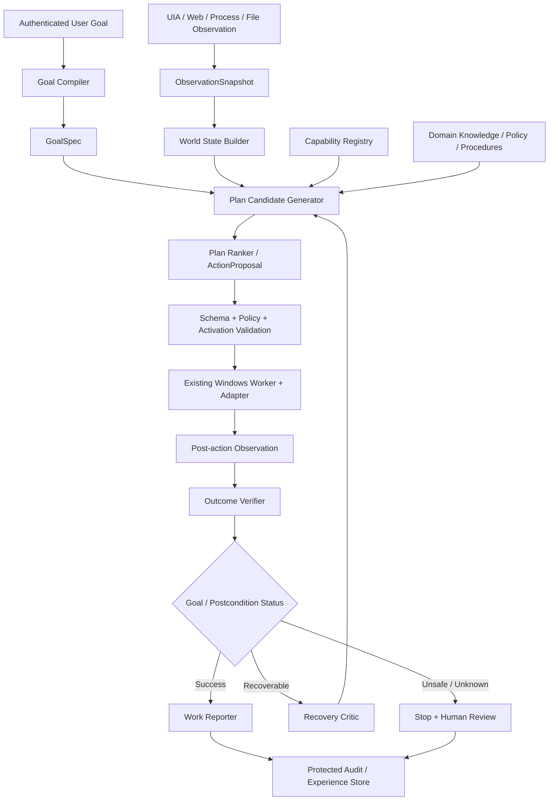

# D2I Safe Execution Kernel and Autonomous Role Runtime

## Active Product Goal

단일 작업 수행은 하위 목표다. 최종 목표는 지속 실행되는 Role Instance가
Work Radar와 Case Queue를 통해 승인된 업무를 감지하고, 각 Case를
verified closure까지 소유하며, 법적·비가역·고위험·불확실·권한 밖
예외만 사람에게 전달하는 것이다.

Safe Execution Kernel:

```text
Goal -> Observation -> World State -> Action Candidates -> Ranking
     -> Policy -> Confirmation when required -> Activation
     -> Trusted Execution -> Re-observation -> Verification
     -> Recovery -> Report
```

Workforce Layer:

```text
Role Contract -> Work Radar -> Work Intake -> Case/Work Queue
-> Situation Model -> Adaptive Planner -> Safe Execution Kernel
-> Verified Closure -> Episodic Memory -> SLA/Outcome Tracking
-> Exception Escalation -> Role-level Report
```

이번 작업 시작 기준선
`866a53926016824f2664dfab4e9bc600fade1cc6`까지의 완료 범위는 Cognitive
IR v1, model-free CognitiveExecutor,
Module Contract/SDK/Conformance, Repository Decoupling, Windows
trust/activation/WFP/audit, read-only UIA/Web Observation Plane, Goal
Compiler, Application Semantics v1, Element Grounder v1, Action Candidate
Provider v1, Plan Ranker v1, Cognitive Action Selection Pipeline v1이다.
`D2I-KRN-100 - Cognitive Policy Admission v1`과 `D2I-KRN-200 -
Trusted Action Execution Binding v1`도 additive Core/Product 경계로
완료됐다. 현재 active next task는
`D2I-KRN-300 - Reobserve and Cognitive Verifier v2`도 완료되었다. 별도
read-only UIA/WebDriver worker, fresh observation proof, protected-invariant
delta, 기존 Verification v2 result, replay 방지 및 protected audit를
결합한다. 현재 first active task는 `D2I-KRN-400 - Recovery, Retry, Replan,
Clarification and Escalation`이다.
기존 C0 및 초기 Cognitive Phase 프롬프트는 historical reference이며
active prompt가 아니다.

적용 우선순위:

```text
AGENTS.md
-> 승인된 ADR
-> docs/product/autonomous-workforce-os.md
-> D2I_COMPILER_MASTER_WORK_ORDER.md
-> 이 추가 작업지시서
-> TASKS.md
-> CODEX_RUNBOOK.md
-> 구현 편의
```

---

# D2I Desktop Cognitive Task Runtime
## Windows 자율 작업 지능 추가 작업지시서

- 문서 버전: 0.1
- 상태: 기존 D2I Compiler 마스터 작업지시서의 보충 기준선
- 적용 트랙: `products/d2i-desktop` 및 관련 Windows host/worker crates
- 기본 언어: Rust
- 기본 배포: 로컬·오프라인·온프레미스
- 핵심 목표: **사전에 고정된 매크로를 재생하는 자동화가 아니라, 사용자의 결과 중심 자연어 지시를 해석하고 현재 PC 상태에 따라 계획·검증·복구하며 근거를 보고하는 계약 기반 디지털 작업자를 구현한다.**

---

# 0. 이 문서의 위치와 적용 원칙

이 문서는 다음 기준 문서를 대체하지 않는다.

1. `AGENTS.md`
2. `D2I_COMPILER_MASTER_WORK_ORDER.md`
3. `TASKS.md`
4. 기존 `docs/ADR`
5. Windows 자율 사용 관련 ADR·운영 절차·위협 모델

충돌 시 적용 우선순위:

```text
AGENTS.md
→ 승인된 ADR
→ D2I_COMPILER_MASTER_WORK_ORDER.md
→ 이 추가 작업지시서
→ 구현 편의
```

이 트랙은 기존 Compiler Phase 0~9와 충돌하지 않도록 별도 작업 ID인 `D2I-COG-*`를 사용한다.

Codex는 한 번에 하나의 Cognitive Phase만 수행한다. 앞 Phase의 종료조건이 충족되지 않으면 다음 Phase를 시작하지 않는다.

---

# 1. 현재 완료된 Windows 기반

다음 구현은 이미 존재하는 기준선으로 취급하며 삭제·대체·우회하지 않는다.

## 1.1 신뢰 및 활성화 체계

- 정확한 Windows 빌드·아키텍처·세션·worker hash를 수집하는 runtime binding probe
- 배포 attestor와 독립 certifier의 Ed25519 이중서명
- 15분 제한 인증서
- 인증서 재사용 및 rollback 방지 activation ledger
- 인증서 변조와 동일 인증서 재활성화 거부

주요 구현:

```text
products/d2i-desktop/src/windows_binding.rs
products/d2i-desktop/src/windows_activation.rs
```

## 1.2 격리 worker 및 IPC

- Job Object 기반 worker 격리
- 프로세스 트리·메모리·종료 제한
- bounded IPC
- worker hash와 활성화 계약 검증

주요 구현:

```text
products/d2i-desktop/src/windows_worker.rs
crates/d2i-windows-host/src/lib.rs
```

## 1.3 활성화된 concrete adapter

### UI Automation

- PID 고정
- 실행파일 hash 고정
- 창 제목 hash 고정
- `AutomationId` 고정
- `Invoke`, `Value/SetValue`, `Toggle`만 허용
- 좌표 기반 임의 클릭을 기본 행동으로 사용하지 않음

### WebDriver

- loopback W3C endpoint만 허용
- session과 origin 고정
- CSS selector 사용
- JavaScript 실행 금지
- 브라우저의 임의 외부 탐색을 허용하지 않음

### 파일 쓰기

- canonical root
- reparse point 차단
- TOCTOU 재검사
- 원자적 이동
- 결과 hash 검증

### 프로세스

- shell 문자열 금지
- direct argv
- 실행파일 hash 검증
- worker가 관리하는 자식 프로세스만 종료

주요 구현:

```text
products/d2i-desktop/src/windows_adapters.rs
products/d2i-desktop/tests/windows_adapters.rs
```

## 1.4 이미 통과한 검증

- `cargo fmt --all -- --check`
- `cargo clippy --workspace --all-targets --all-features -- -D warnings`
- `cargo test --workspace --all-features`
- `cargo build --workspace --release`
- 실제 Windows worker 통합 테스트
- CLI `probe → certify → verify → ledger init → activate → ledger check`
- 인증서 변조 거부
- 동일 인증서 재활성화 거부

기존 테스트를 삭제하거나 완화해 새 기능을 통과시키지 않는다.

---

# 2. 해결하려는 문제

현재 기반은 안전하게 제한된 행동을 수행할 수 있는 **손발과 신뢰체인**이다. 그러나 다음 능력은 별도로 구현해야 한다.

- 사용자의 불완전한 자연어에서 실제 업무 목표를 추출
- 현재 앱·브라우저·파일·프로세스 상태를 의미 단위로 관찰
- 업무 규칙과 현재 상태를 결합해 상황을 판단
- 사전에 고정되지 않은 경로를 제한된 Capability 조합으로 계획
- 한 단계 실행 후 실제 업무 결과를 검증
- 예상과 다르면 남은 계획을 폐기하고 복구·재계획
- 처리한 사실, 미처리 사항, 의견, 불확실성, 근거를 보고
- 사람의 수정과 결과를 경험 데이터로 기록하되 운영 패키지를 즉시 변경하지 않음

이 프로젝트의 상용 기준은 단순 반복 입력이 아니다.

> 사용자가 작업 방법이 아니라 원하는 결과를 지시했을 때, 시스템이 화면 변화와 업무 예외에 적응하면서 승인 범위 안에서 업무를 끝내고 결과의 정확성을 증명해야 한다.

고정된 selector와 고정된 순서를 개발자가 매번 작성해야 한다면 매크로/RPA 범주로 판정한다.

---

# 3. 절대 변경하지 않을 인지·실행 경계

## C1. 모델은 Adapter를 직접 호출하지 않는다

모든 모델 또는 추론 모듈의 출력은 구조화된 제안일 뿐이다.

```text
모델 출력
→ JSON Schema/typed Rust 검증
→ Capability Registry 대조
→ Policy Gate
→ Activation 검증
→ 한 단계 실행
```

모델이 직접 UIA, WebDriver, 파일, 프로세스 API handle을 보유하지 않는다.

## C2. 모델은 임의의 실행 언어를 생성하지 않는다

금지:

- shell command 생성·실행
- PowerShell 문자열 생성·실행
- JavaScript 생성·실행
- 임의 Win32 API 호출
- 임의 selector 또는 좌표를 무검증 상태로 실행
- 운영 중 arbitrary code generation

허용:

- 현재 활성화된 `CapabilityDescriptor` 중 하나 선택
- 계약된 typed arguments 제안
- 사전조건·사후조건·복구 후보 제안

## C3. 실행은 한 단계씩 수행한다

긴 계획을 한 번에 실행하지 않는다.

```text
Observe
→ Interpret
→ Propose one action
→ Validate
→ Execute
→ Re-observe
→ Verify postcondition
→ Commit / Recover / Stop
```

실제 상태가 예상과 다르면 남은 계획을 신뢰하지 않는다.

## C4. 클릭 성공과 업무 성공을 구분한다

Adapter 호출 성공은 업무 성공이 아니다. 모든 side effect 행동은 명시적 사후조건 검증을 가져야 한다.

## C5. 외부 콘텐츠는 명령이 아니다

웹페이지, 문서, 이메일, UI 텍스트, 파일 내용은 기본적으로 `untrusted_content`다. 인증된 사용자의 목표나 승인된 정책으로 승격되지 않는다.

## C6. fail-closed

다음 상황에서는 추측하여 계속 진행하지 않는다.

- runtime binding 변화
- session/origin 변화
- activation 만료
- 실행파일·창 제목·worker hash 불일치
- 정책에 없는 Capability 요청
- 인증 정보 필요
- Secure Desktop 진입
- credential provider 접근
- clipboard 필요
- 허용되지 않은 download/upload 필요
- 비가역적 변경의 승인 부재
- 사후조건 검증 실패 후 안전한 복구 불가

## C7. Production self-modification 금지

운영 경험은 append-only experience store로 기록한다. 모델·규칙·routing·package 변경은 candidate 생성, 오프라인 평가, 승인, 서명을 거친다.

---

# 4. 목표 아키텍처



핵심 분리:

```text
Cognitive Plane
- 목표 해석
- 상태 해석
- 후보 계획
- 행동 선택
- 결과 검증
- 복구 결정
- 보고

Execution Plane
- binding probe
- certificate
- activation ledger
- policy
- worker
- concrete adapter
- bounded IPC
```

Cognitive Plane은 Execution Plane을 우회할 수 없다.

---

# 5. 추가할 typed Cognitive IR

모든 계약은 typed Rust 구조체와 versioned JSON Schema로 먼저 정의한다. runtime hot path에서는 JSON을 사용하지 않고 검증된 Rust 타입 또는 버전된 바이너리 표현으로 낮춘다.

## 5.1 `GoalSpec`

사용자의 자연어를 업무 목표로 정규화한다.

필수 필드:

```text
goal_id
actor / role
objective
scope
entities
constraints
required_outcomes
success_criteria
forbidden_outcomes
risk_class
confirmation_policy
deadline
source_trust
ambiguities
```

예시:

```json
{
  "goal_id": "monthly-training-review",
  "objective": "이번 달 교육 운영 이상 사례를 확인하고 승인 범위에서 처리한다",
  "scope": {"period": "current_month"},
  "required_outcomes": [
    "이상 사례 목록 생성",
    "자동 처리 가능 건 수정",
    "미처리 건의 이유 보고"
  ],
  "constraints": [
    "원본 데이터 삭제 금지",
    "결제 상태 자동 변경 금지",
    "승인되지 않은 외부 전송 금지"
  ],
  "risk_class": "business_state_change",
  "confirmation_policy": "confirm_before_irreversible_action"
}
```

## 5.2 `ObservationSnapshot`

현재 PC 상태의 의미 기반·읽기 전용 표현이다.

필수 필드:

```text
snapshot_id
time
runtime_binding_id
activation_id
source_type
trust_label
process/window/session/origin identity
visible controls/elements
current values/states
errors/notices
state_hash
redaction metadata
```

UIA 예시 필드:

```text
PID
executable hash
window title hash
AutomationId
ControlType
Name
Value
ToggleState
Enabled
Visible
SupportedPatterns
parent/child relation
```

Web 예시 필드:

```text
session ID
origin
URL
page title
role/name
selector handle
value
options
visible/enabled
validation message
navigation state
```

원칙:

- 비밀번호·토큰·민감값을 Observation에 평문으로 포함하지 않는다.
- screenshot raw pixels는 기본 관찰 형식이 아니다.
- 전체 DOM·전체 UI tree를 무제한 전달하지 않는다.
- 크기·깊이·요소 수를 제한한다.

## 5.3 `WorldState`

Observation을 업무 의미로 해석한 상태다.

필수 필드:

```text
facts
entities
relations
current_workflow_state
completed_subgoals
open_subgoals
inconsistencies
unknowns
policy_relevant_state
confidence
evidence_refs
```

사실과 추론을 구분한다.

```text
observed_fact
inferred_state
user_assertion
policy_fact
untrusted_content
```

## 5.4 `CapabilityDescriptor`

모델이 선택할 수 있는 허용 행동의 계약이다.

필수 필드:

```text
capability_id
adapter
operation
input_schema
preconditions
postcondition_types
side_effect_class
reversible
risk_class
confirmation_requirement
network_requirement
credential_requirement
activation_scope
timeout
retry_limit
```

초기 Registry:

```text
uia.invoke
uia.set_value
uia.toggle
webdriver.click
webdriver.type
webdriver.select
file.atomic_write
process.spawn_managed
process.terminate_managed
```

읽기 전용 Capability를 별도로 둔다.

```text
uia.observe
webdriver.observe
process.observe
file.metadata_read
```

## 5.5 `PlanGraph`

업무 목표를 달성하기 위한 분기 가능한 계획이다.

노드 유형:

```text
Observe
Interpret
SelectCapability
ProposeAction
PolicyGate
HumanReview
Execute
Verify
Branch
LoopBounded
Recover
Return
```

모든 loop는 bounded여야 한다.

## 5.6 `ActionProposal`

다음 한 단계의 행동 제안이다.

필수 필드:

```text
proposal_id
goal_id
world_state_id
intent
capability_id
target binding
typed arguments
preconditions
expected_postconditions
risk
confidence
evidence
recovery options
expires_at
```

예시:

```json
{
  "intent": "미수료 항목만 표시",
  "capability_id": "webdriver.select",
  "target": {"selector_handle": "course-status"},
  "arguments": {"value": "미수료"},
  "preconditions": ["target_visible", "target_enabled"],
  "expected_postconditions": [
    "selected_value_is_incomplete",
    "result_list_refreshed"
  ],
  "risk": "read_only_filter"
}
```

## 5.7 `VerificationSpec` / `VerificationResult`

행동이 아니라 업무 상태 변화가 성공했는지를 검증한다.

필수 결과 상태:

```text
passed
failed
inconclusive
unsafe
```

필수 필드:

```text
expected_postconditions
observed_postconditions
mismatches
side_effect_scope
unexpected_changes
confidence
evidence
```

## 5.8 `RecoveryDecision`

실패 시 허용된 복구 후보를 선택한다.

```text
retry_same_observation
reobserve_and_rebind
alternate_capability
replan_from_current_state
request_user_input
request_reauthentication
rollback
stop_and_report
```

복구 횟수, 총 단계 수, 총 실행시간을 제한한다.

## 5.9 `WorkReport`

사용자에게 결과와 의견을 보고하기 전의 구조화 계약이다.

필수 필드:

```text
facts
actions_completed
verified_outcomes
unresolved_items
opinion
opinion_basis
uncertainty
human_decisions_required
policy_blocks
build_id
modules_used
audit_refs
timings
```

자연어 출력은 이 구조에서 렌더링한다.

## 5.10 `CognitiveEpisode`

학습·평가를 위한 한 작업의 전체 기록이다.

필수 필드:

```text
goal
observation sequence
world state sequence
candidate actions
selected actions
policy decisions
execution results
verification results
recovery decisions
human corrections
final outcome
critical errors
provenance
```

---

# 6. 구현할 모듈

## 6.1 Observation Plane

### `UiaObservationAdapter`

- 읽기 전용
- 기존 binding identity 재사용
- 허용된 앱·창·control tree만 조회
- control depth, element count, text size 제한
- Value 조회 시 민감정보 정책 적용
- state hash 생성

### `WebObservationAdapter`

- 고정된 WebDriver session/origin만 조회
- 현재 URL, title, role/name/value/options를 정규화
- JavaScript 금지
- redirect 전후 origin 검증
- raw HTML 전체 전달 금지
- 외부 콘텐츠에 `untrusted_content` label 부여

### `ProcessObservationAdapter`

- 허용된 managed process 상태만 조회
- 실행파일 hash, PID, lifecycle, exit status 제공

### `FileObservationAdapter`

초기에는 파일 내용 전체 읽기보다 허용 root 안의 metadata와 hash 조회부터 시작한다. 내용 읽기는 별도 정책·ADR 후 추가한다.

## 6.2 `GoalCompiler`

입력:

```text
authenticated user natural language
session context
role
available capabilities
```

출력:

```text
GoalSpec
```

기능:

- 목표·대상·기간·조건 추출
- 질문·조회·변경 요청 구분
- 성공 조건 후보 생성
- 모호성 탐지
- 비가역 작업 탐지
- 지원되지 않는 Capability 요구 탐지

## 6.3 `WorldStateBuilder`

초기 구현은 규칙 기반이어야 한다. 모델은 후속 교체 가능한 `Executor`로 추가한다.

## 6.4 `PlanCandidateGenerator`

초기에는 다음 소스에서 후보를 만든다.

- Capability Registry
- 승인된 procedure
- 검증된 과거 episode
- 현재 GoalSpec과 WorldState

임의 행동 문자열을 생성하지 않는다.

## 6.5 `PlanRanker`

후보 계획 또는 다음 행동 후보를 순위화한다.

hard constraint를 먼저 적용한다.

- policy
- activation
- binding
- I/O schema
- risk
- side effect
- network
- credential
- unsupported capability

품질 통과 후보만 비용·성공 가능성을 비교한다.

## 6.6 `CognitiveExecutor`

한 단계 실행 루프의 기준 구현이다.

개념적 루프:

```text
while goal not complete:
    observe
    validate binding and activation
    build world state
    generate bounded candidates
    rank candidate
    validate schema/policy
    execute exactly one action
    observe again
    verify postcondition
    if success: commit
    elif recoverable: bounded recovery
    else: stop and report
```

## 6.7 `OutcomeVerifier`

초기에는 typed rules와 명시적 postcondition matcher를 사용한다.

후속 모델은 다음에만 사용한다.

- 문구 변형
- 의미상 동등한 상태
- 복수 신호의 일관성 판단

고위험 업무 성공 판정은 모델 단독으로 하지 않는다.

## 6.8 `RecoveryCritic`

실패 유형을 분류하고 허용된 복구 후보 중 하나를 선택한다.

## 6.9 `WorkReporter`

`WorkReport`를 읽기 쉬운 자연어로 렌더링한다. 사실·추론·의견·불확실성을 구분한다.

---

# 7. 모델 구성 원칙

D2I 철학에 따라 하나의 범용 모델에 모든 역할을 맡기지 않는다.

초기 기능 모델:

```text
Goal Compiler
Element Grounder
Plan Ranker
Outcome Verifier
Recovery Critic
Work Reporter
```

각 모듈은 다음 executor 후보를 가질 수 있다.

```text
Rule
Lookup
Sparse Retrieval
Classical Model
Tiny Neural Expert
SLM
Human Review
```

선택 원칙:

> 요구 품질과 안전 기준을 만족하는 가장 작은 실행기를 선택한다.

모델이 없거나 평가 기준을 통과하지 못하면 규칙 기반 기준 구현 또는 사람 검토로 fallback한다.

외부 LLM API는 기본 구현·테스트·운영 경로에 포함하지 않는다.

---

# 8. 데이터 구축 원칙

## 8.1 공개 데이터보다 D2I 스키마가 먼저다

OpenCUA, Mind2Web, WorkArena 등 공개 데이터는 D2I 계약이 확정된 뒤 보조 데이터로만 변환한다.

우선 순서:

```text
Cognitive IR 정의
→ Observation Plane
→ deterministic teacher runtime
→ 실제 사람의 업무 시연 수집
→ D2I episode 변환
→ 모델 학습·평가
```

## 8.2 1차 데이터는 실제 사람의 판단 과정이다

단순 클릭 로그만 수집하지 않는다.

필수 기록:

- 사용자가 지시한 결과
- 당시 관찰 상태
- 가능한 행동 후보
- 사람이 선택한 행동
- 선택 이유 또는 업무 근거
- 실행 결과
- 성공 판정 기준
- 오류와 예외
- 사람이 수정한 내용
- 최종 결과

## 8.3 신뢰 레이블

모든 입력에 다음 중 하나를 부여한다.

```text
authenticated_user_instruction
approved_policy
approved_procedure
verified_operational_state
observed_ui_state
untrusted_web_content
untrusted_document_content
model_inference
human_correction
```

## 8.4 공개 데이터 라이선스

상업 이용 가능한 라이선스 allowlist를 통과한 데이터만 candidate dataset에 포함한다. 원천 라이선스, attribution, 수정 여부, 개인정보 검토를 `dataset-manifest`에 기록한다.

## 8.5 학습 데이터 승격

운영 로그를 자동 정답으로 사용하지 않는다.

```text
Experience Store
→ Candidate Dataset
→ duplicate/leakage/poisoning 검사
→ train/eval split
→ offline evaluation
→ regression
→ critical-error gate
→ signature and approval
→ candidate package
```

---

# 9. 기억 구조

## 9.1 Working Memory

현재 한 작업의 목표, 상태, 후보 계획, 중간 결과. 작업 종료 후 정책에 따라 삭제한다.

## 9.2 Procedural Memory

검증된 업무 절차와 복구 패턴. 승인된 package에 포함한다.

## 9.3 Semantic Memory

업무 규정, 시스템 설명, 용어, 판단 기준. provenance와 effective date를 가진다.

## 9.4 Episodic Memory

과거 작업의 성공·실패·사람 수정. Production 판단 규칙으로 즉시 사용하지 않고 검색 또는 candidate 생성에만 사용한다.

각 기억은 사용자·역할·고객·보존기간·암호화·접근정책을 분리한다.

---

# 10. Cognitive Desktop Phase 백로그

## Phase C0 — Windows Security Boundary Closure

작업 ID: `D2I-COG-000` ~ `D2I-COG-006`

목표:

- AppContainer 또는 동등한 별도 보안 주체·네트워크 격리
- OS 키 저장소
- 사용자 인증 및 역할
- 보호된 audit 저장소
- 보호된 activation 저장소
- 실제 앱 UIA Invoke/SetValue/Toggle 검증
- 실제 브라우저 Click/Type/Select 검증

요구:

- 기존 Job Object worker를 보존한다.
- AppContainer가 불가능하면 동등한 격리 수준과 차이를 ADR에 기록한다.
- 네트워크는 대상별 allowlist이며 기본 deny다.
- 브라우저 redirect 선행 트래픽까지 egress 정책으로 통제한다.
- private key와 credential을 평문 파일에 저장하지 않는다.
- audit/activation rollback·삭제·변조를 탐지한다.
- Secure Desktop, credential provider, clipboard, download/upload는 계속 fail-closed다.

종료조건:

- [ ] network deny 테스트 통과
- [ ] 허용 대상만 egress 가능
- [ ] 사용자·역할 인증 테스트
- [ ] key store에서 private key 보호
- [ ] audit/activation 변조·rollback 거부
- [ ] 실제 앱 3개 이상에서 UIA pattern 검증
- [ ] 실제 허용 origin 2개 이상에서 WebDriver 검증
- [ ] 기존 모든 Windows adapter 테스트 통과

C0 종료 전 Cognitive model 실행을 운영 경로에 추가하지 않는다.

---

## Phase C1 — Observation Plane

작업 ID: `D2I-COG-100` ~ `D2I-COG-106`

산출물:

- `UiaObservationAdapter`
- `WebObservationAdapter`
- `ProcessObservationAdapter`
- 제한적 `FileObservationAdapter`
- `ObservationSnapshot`
- `TrustLabel`
- `StateHash`
- redaction policy

종료조건:

- [ ] 같은 상태에서 deterministic state hash
- [ ] 민감정보 redaction 검증
- [ ] UI tree/DOM size bound
- [ ] session/origin/window identity 변화 탐지
- [ ] observation이 side effect를 발생시키지 않음
- [ ] untrusted content가 명령으로 승격되지 않음
- [ ] fixture와 실제 앱 observation round-trip

---

## Phase C2 — Cognitive IR and Contract Freeze

작업 ID: `D2I-COG-200` ~ `D2I-COG-209`

먼저 작성할 ADR:

```text
ADR 0012 — Contract-Governed Cognitive Task Runtime
```

산출물:

- `GoalSpec`
- `WorldState`
- `CapabilityDescriptor`
- `PlanGraph`
- `ActionProposal`
- `VerificationSpec`
- `VerificationResult`
- `RecoveryDecision`
- `WorkReport`
- `CognitiveEpisode`
- 각 타입의 JSON Schema와 Rust type

종료조건:

- [ ] unknown field/version 정책 명확
- [ ] schema validation
- [ ] action proposal이 Registry에 없는 Capability를 표현할 수 없음
- [ ] 모든 side effect action에 postcondition 필수
- [ ] bounded loop/recovery limit 필수
- [ ] trust label 소실 방지 property test
- [ ] serialization round-trip
- [ ] runtime hot path JSON 미사용 계획 문서화

---

## Phase C3 — Deterministic Cognitive Teacher Runtime

작업 ID: `D2I-COG-300` ~ `D2I-COG-309`

목표:

모델 없이도 계약 전체를 실행하는 정확성 기준선을 만든다.

산출물:

- 규칙 기반 `GoalCompiler`
- 규칙 기반 `WorldStateBuilder`
- procedure 기반 `PlanCandidateGenerator`
- hard constraint matcher
- `CognitiveExecutor`
- typed `OutcomeVerifier`
- bounded recovery
- `WorkReporter` template renderer
- deterministic replay

종료조건:

- [ ] observe→propose→validate→execute→verify 루프
- [ ] 한 번에 한 side effect만 실행
- [ ] postcondition 실패 시 남은 계획 폐기
- [ ] origin/session/binding 변화 시 즉시 중단
- [ ] unsupported capability 정확히 보고
- [ ] 100개 이상의 synthetic/golden episode
- [ ] deterministic replay
- [ ] 모든 Decision/WorkReport에 evidence, build ID, modules, timings, policy 결과

이 Runtime은 최종 지능이 아니라 모델 학습과 비교를 위한 Teacher/Reference다.

---

## Phase C4 — Human Demonstration and Experience Capture

작업 ID: `D2I-COG-400` ~ `D2I-COG-408`

산출물:

- 사용자 목표 입력 기록
- observation/action/postcondition 기록
- candidate action 기록
- 사람 선택 및 수정 기록
- final outcome 기록
- append-only Cognitive Experience Store
- redaction/export pipeline
- candidate dataset builder

요구:

- 인증정보·민감값은 원문으로 학습 데이터에 남기지 않는다.
- 실제 사용자의 UI 조작을 무조건 정답으로 간주하지 않는다.
- 성공 기준과 사람 검수 결과가 있는 episode만 positive candidate가 된다.
- 실패·중단·거부 사례를 별도 보존한다.
- 화면별 selector를 정답 자체로 과적합하지 않도록 의미 label과 binding evidence를 함께 기록한다.

종료조건:

- [ ] append-only 및 tamper evidence
- [ ] 사용자/고객별 격리
- [ ] train/eval leakage 검사
- [ ] duplicate·near-duplicate 검사
- [ ] poisoning flag
- [ ] 최소 3개 실제 앱·2개 실제 웹 업무의 검수된 episode 세트

---

## Phase C5 — Functional Small Models

작업 ID: `D2I-COG-500` ~ `D2I-COG-509`

한 번에 한 모델만 도입하고 reference baseline과 비교한다.

권장 순서:

1. `GoalCompiler`
2. `ElementGrounder`
3. `PlanRanker`
4. `OutcomeVerifier`
5. `RecoveryCritic`
6. `WorkReporter`

요구:

- 각 모델은 `ExecutorDescriptor`와 평가셋을 가진다.
- 모델 출력은 typed schema를 통과해야 한다.
- 모델이 Adapter handle을 소유하지 않는다.
- reference rule executor를 fallback으로 유지한다.
- 품질·critical error hard constraint 통과 후에만 비용을 비교한다.
- 하나의 범용 모델로 모든 모듈을 합치는 것을 기본 선택으로 하지 않는다.
- 공개 데이터는 D2I episode 형식으로 변환하고 라이선스 manifest를 남긴다.

종료조건:

- [ ] 모델별 gold/negative/ambiguous/unsafe/unsupported eval
- [ ] reference 대비 정확도·오류·latency·memory·copy report
- [ ] critical error 증가 시 채택 거부
- [ ] model unavailable 시 fail-closed/fallback
- [ ] deterministic 또는 seed/config 명시
- [ ] package와 runtime이 특정 모델 family에 종속되지 않음

---

## Phase C6 — Bounded Dynamic Planning and Recovery

작업 ID: `D2I-COG-600` ~ `D2I-COG-609`

목표:

고정 recipe를 선택하는 수준을 넘어, 보지 못한 상태 변화에서 허용 Capability를 조합해 제한적으로 재계획한다.

요구:

- 후보 행동은 Capability Registry에서만 생성한다.
- 총 단계, 재계획, 재시도, 실행시간, 메모리를 제한한다.
- 비가역 동작은 사람 승인 없이는 진행하지 않는다.
- unknown state에서 추측 실행하지 않는다.
- UI drift, validation error, transient delay, missing element, alternate path를 구분한다.
- Policy·activation·binding 검증은 매 단계 재수행한다.

종료조건:

- [ ] unseen state variation 평가
- [ ] UI label/order 변화 평가
- [ ] transient error 복구 평가
- [ ] policy injection 공격 평가
- [ ] origin/session substitution 공격 평가
- [ ] bounded replanning 증명
- [ ] 같은 목표의 다른 실행 경로 성공 사례
- [ ] 실패 시 정확한 human review 전환

---

## Phase C7 — Commercial Intelligence Gate

작업 ID: `D2I-COG-700` ~ `D2I-COG-708`

이 Phase는 단순히 자동화가 작동하는지를 평가하지 않는다. 매크로·RPA 대비 AI를 사용할 경제적·기능적 이유를 검증한다.

평가축:

- 결과 중심 지시 이해
- 보지 못한 입력·예외 처리
- UI 변화 적응
- 업무 규칙 기반 판단
- 잘못된 데이터·충돌 탐지
- 복구 성공률
- 사람 개입률
- 치명 오류율
- 근거 정확성
- 업무 성공 검증
- 신규 업무 적용 비용
- 유지보수 비용
- 매크로/RPA 대비 총비용

필수 비교군:

```text
fixed macro
scripted RPA
D2I deterministic teacher runtime
D2I cognitive model runtime
human operator
```

상용 후보의 필수 조건:

- 정책 우회·권한 외 side effect 0건
- 승인 없는 비가역 동작 0건
- 완료 보고 전 postcondition 검증 100%
- 단순 반복 업무 외 예외·변형 업무에서 RPA 대비 명확한 이점
- 새로운 화면 변형마다 개발자가 selector와 절차를 전부 다시 작성하지 않아도 됨
- 실패·불확실 상태에서 거짓 완료 보고를 하지 않음
- 고객이 평가한 업무 결과 품질 기준 통과

구체 수치 threshold는 도메인별 `evaluation/thresholds.yaml`로 관리하며 코드에 보편 상수로 하드코딩하지 않는다.

---

# 11. 테스트 전략

## 11.1 Unit

- IR parser/validator
- trust propagation
- capability matching
- postcondition matcher
- recovery limits
- report renderer

## 11.2 Golden

```text
user goal
+ observation sequence
+ expected world state
+ candidate actions
+ selected action
+ verification
+ final report
```

## 11.3 Integration

```text
authenticated goal
→ observe actual app
→ compile GoalSpec
→ propose action
→ policy/activation
→ execute one step
→ re-observe
→ verify
→ audit/report
```

## 11.4 Security

- prompt/instruction injection in web content
- UI text pretending to be administrator instruction
- selector substitution
- window/process replacement
- session/origin replacement
- stale activation
- ledger rollback
- observation resource exhaustion
- secret leakage
- malicious accessibility tree
- unbounded recovery

## 11.5 Robustness

- renamed labels
- reordered controls
- extra dialog
- delayed response
- validation error
- empty result
- duplicate records
- conflicting data
- partial completion
- application restart

## 11.6 Reproducibility

- same episode + same package + same seed/config
- deterministic reference replay
- model version and dataset hash fixation

## 11.7 Benchmark

- end-to-end p50/p95/p99
- observation cost
- planning cost
- verification cost
- adapter execution cost
- copy count/bytes
- peak RSS
- module activation count
- human intervention rate
- critical error rate

근거 없는 성능 수치를 문서화하지 않는다.

---

# 12. 제안 저장소 구조

기존 구조를 조사한 뒤 최소한으로 추가한다. 아래는 후보이며 실제 저장소와 충돌하면 ADR 후 조정한다.

```text
products/d2i-desktop/
├─ src/
│  ├─ cognitive/
│  │  ├─ mod.rs
│  │  ├─ goal.rs
│  │  ├─ observation.rs
│  │  ├─ world_state.rs
│  │  ├─ capability.rs
│  │  ├─ plan.rs
│  │  ├─ verifier.rs
│  │  ├─ recovery.rs
│  │  ├─ reporter.rs
│  │  └─ executor.rs
│  ├─ windows_binding.rs
│  ├─ windows_activation.rs
│  ├─ windows_adapters.rs
│  └─ windows_worker.rs
├─ tests/
│  ├─ cognitive_contracts.rs
│  ├─ cognitive_runtime.rs
│  ├─ observation_security.rs
│  └─ windows_adapters.rs
crates/
├─ d2i-cognitive-api/
├─ d2i-cognitive-ref/
└─ d2i-windows-host/
schemas/json-schema/cognitive/
docs/adr/0012-contract-governed-cognitive-task-runtime.md
docs/cognitive-desktop.md
examples/desktop-cognitive/
```

새 crate는 실제 경계와 재사용성이 확인될 때만 추가한다. 초기에는 `products/d2i-desktop` 내부 모듈로 시작할 수 있다.

---

# 13. Codex 공통 수행 방식

각 Cognitive Phase에서 Codex는 다음 순서를 따른다.

1. `AGENTS.md`, 마스터 작업지시서, 이 추가 지시서, 관련 ADR을 읽는다.
2. 현재 저장소와 Windows 구현을 조사한다.
3. 완료된 신뢰체인·adapter·test를 설명하고 보존한다.
4. 이번 Phase 범위를 10줄 이내로 요약한다.
5. 보안 모델 또는 public contract가 변하면 ADR을 먼저 작성한다.
6. 최소 구현을 한다.
7. unit/integration/security/reproducibility test를 추가한다.
8. 다음을 실행한다.

```text
cargo fmt --all -- --check
cargo clippy --workspace --all-targets --all-features -- -D warnings
cargo test --workspace --all-features
cargo build --workspace --release
```

9. 변경 파일, 테스트, 제한, 보안 위험, 다음 정확한 작업을 보고한다.
10. 다음 Phase는 시작하지 않는다.

---

# 14. Codex 금지사항

- 기존 Windows trust chain 재작성
- Job Object 격리를 제거하고 더 약한 구조로 교체
- 모델이 adapter를 직접 호출하게 구현
- UI 좌표 기반 범용 매크로를 핵심 계약으로 추가
- shell/PowerShell/JavaScript 자유 생성 실행
- unrestricted DOM/UI tree를 모델 입력으로 전달
- password/token을 Observation·Audit·Dataset에 평문 저장
- 외부 LLM API를 기본 경로에 추가
- 네트워크 기본 허용
- policy/activation 검증을 한 번만 수행하고 긴 계획 실행
- 사후조건 없는 side effect action
- 실패한 상태에서 남은 계획 계속 실행
- 운영 로그를 자동 정답으로 사용
- production package/model/rule in-place mutation
- 평가셋 없이 모델 도입
- 단순 매크로 성공률을 AI 업무 성공률로 보고
- 테스트를 삭제하거나 완화해 통과
- benchmark 없는 상용성·속도 주장

---

# 15. 즉시 실행할 다음 Codex 프롬프트

아래 프롬프트는 **현재 남은 보안 경계 작업인 Phase C0만 수행**할 때 사용한다.

```text
당신은 Windows 보안, Rust 시스템 소프트웨어, 인증·감사 런타임을 담당하는 리드 엔지니어다.

먼저 다음을 읽어라.

1. AGENTS.md
2. D2I_COMPILER_MASTER_WORK_ORDER.md
3. D2I_DESKTOP_COGNITIVE_RUNTIME_ADDENDUM.md
4. TASKS.md
5. docs/adr/0011-signed-windows-adapter-activation.md
6. docs/desktop-autonomy.md
7. docs/threat-model.md
8. 현재 products/d2i-desktop 및 crates/d2i-windows-host 코드와 테스트

이번 작업에서는 Phase C0(D2I-COG-000~D2I-COG-006)만 수행하라.
Cognitive model, Goal Compiler, dynamic planner, self-learning은 아직 구현하지 마라.

현재 완료 구현을 먼저 확인하고 보존하라.

- runtime binding probe
- attestor/certifier Ed25519 이중서명
- 15분 인증서
- activation ledger 재사용·rollback 방지
- Job Object worker와 bounded IPC
- UIA/WebDriver/file/process concrete adapter
- 기존 Windows worker 통합 테스트

목표:

1. Job Object를 유지하면서 AppContainer 또는 동등한 별도 보안 주체·네트워크 격리를 추가한다.
2. AppContainer를 적용할 수 없는 구성은 임의 우회하지 말고 동등성 차이와 잔여 위험을 ADR에 기록한다.
3. 네트워크 기본 deny와 대상별 egress allowlist를 구현한다.
4. 브라우저 redirect의 선행 트래픽까지 방화벽 또는 브라우저 egress 정책으로 제한한다.
5. Ed25519 private key와 credential을 Windows OS 키 저장소 또는 동등한 보호 저장소에 둔다.
6. 사용자 인증·역할·고위험 활성화 재인증 계약을 추가한다.
7. audit와 activation 저장소에 암호화, 무결성, rollback·삭제·변조 탐지를 추가한다.
8. 실제 Windows 앱을 대상으로 UIA Invoke/SetValue/Toggle E2E 테스트를 추가한다.
9. 실제 허용된 브라우저 origin을 대상으로 W3C WebDriver Click/Type/Select E2E 테스트를 추가한다.
10. Secure Desktop, credential provider, clipboard, download/upload는 계속 fail-closed로 유지한다.

보안 요구:

- network_allowed=true를 광범위한 기본값으로 유지하지 마라.
- shell 문자열, JavaScript, 임의 좌표 클릭을 추가하지 마라.
- key, password, token을 로그·fixture·audit에 평문으로 남기지 마라.
- 테스트에서 외부 공용 인터넷에 의존하지 마라. 로컬 또는 통제된 test origin을 사용하라.
- 기존 이중서명·ledger·binding 검증을 우회하지 마라.
- 인증 실패, egress 거부, 저장소 rollback, process/window/session/origin 교체를 테스트하라.

문서:

- 보안 모델 변경 ADR
- desktop-autonomy.md
- threat-model.md
- 운영 키 생성·회전·복구 절차
- audit/activation 보존·백업·rollback 정책

필수 검사:

cargo fmt --all -- --check
cargo clippy --workspace --all-targets --all-features -- -D warnings
cargo test --workspace --all-features
cargo build --workspace --release

작업 후 다음을 보고하라.

1. 조사 결과와 기존 구현 보존 여부
2. Phase C0 완료 범위
3. 변경 파일
4. 격리·네트워크·키 저장·인증·저장소 설계
5. 실행 명령과 결과
6. E2E·보안 테스트
7. 남은 플랫폼 제한
8. Phase C0 종료조건 체크리스트
9. 정확한 다음 작업은 Phase C1 Observation Plane이라고만 기록하고 시작하지 마라.
```

---

# 16. Phase C1 실행 프롬프트

C0 종료조건이 모두 충족된 뒤에만 사용한다.

```text
AGENTS.md, D2I_COMPILER_MASTER_WORK_ORDER.md,
D2I_DESKTOP_COGNITIVE_RUNTIME_ADDENDUM.md,
TASKS.md, Windows activation/security ADR과 현재 코드를 읽어라.

Phase C1(D2I-COG-100~D2I-COG-106)만 수행하라.

목표:
- UiaObservationAdapter
- WebObservationAdapter
- ProcessObservationAdapter
- 제한적 FileObservationAdapter
- ObservationSnapshot / TrustLabel / StateHash
- redaction 및 resource bound

요구:
1. 기존 action adapter를 변경하거나 약화하지 마라.
2. observation은 read-only여야 한다.
3. PID/executable hash/window title hash/session/origin identity를 유지하라.
4. UI tree와 DOM의 깊이·요소 수·문자열 크기를 제한하라.
5. password/token/secret을 redaction하라.
6. 웹·문서·UI 콘텐츠를 untrusted_content로 표시하라.
7. 같은 상태에서 deterministic state hash를 생성하라.
8. session/origin/window/process 교체를 탐지하라.
9. synthetic fixture와 실제 앱 E2E observation 테스트를 추가하라.
10. Goal Compiler, planner, model 학습은 아직 구현하지 마라.

필수 검사와 종료 보고를 수행하고 Phase C2는 시작하지 마라.
```

---

# 17. 최종 목표 정의

다음 조건을 만족할 때 D2I Desktop의 인지형 작업자를 구현했다고 본다.

```text
사용자가 결과를 자연어로 지시한다.
→ 시스템이 목표와 성공조건을 구조화한다.
→ 실제 PC 상태를 의미 기반으로 관찰한다.
→ 업무 지식과 현재 상태로 판단한다.
→ 허용 Capability만으로 다음 행동을 선택한다.
→ 기존 서명·정책·activation 체계가 실행을 승인한다.
→ 한 단계 실행 후 업무 결과를 검증한다.
→ 실패하면 제한적으로 복구·재계획한다.
→ 불확실하거나 위험하면 사람에게 넘긴다.
→ 사실·의견·근거·미처리 사항을 감사 가능한 보고로 반환한다.
```

이 목표는 단순 매크로나 고정 RPA를 만드는 것이 아니다.

> D2I Desktop의 상용 가치는 정해진 클릭을 빠르게 반복하는 데 있지 않고, 사람의 판단과 적응이 필요해 기존 자동화가 실패하던 업무를 검증 가능한 방식으로 수행하는 데 있다.
